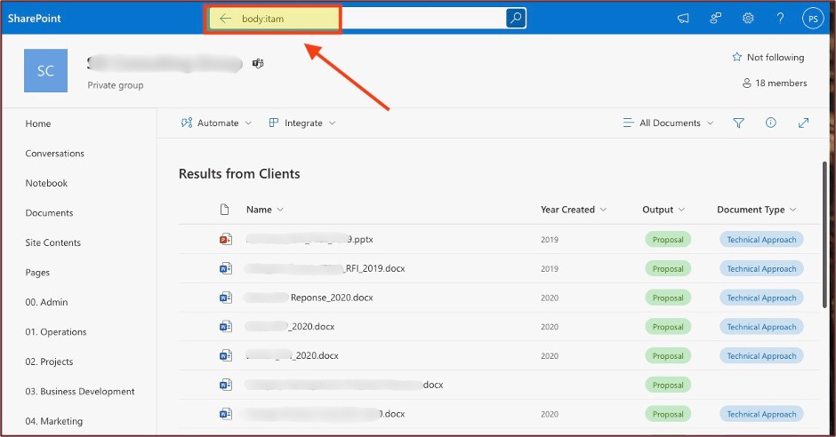
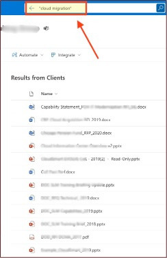
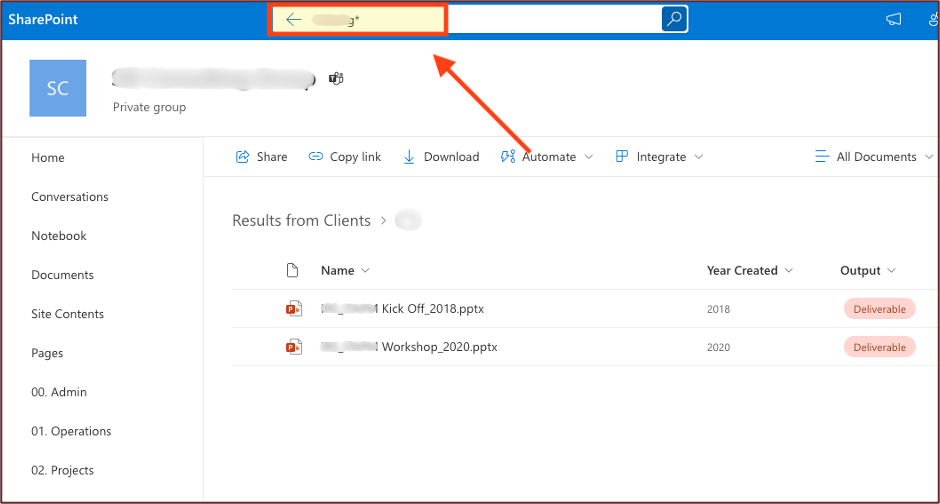
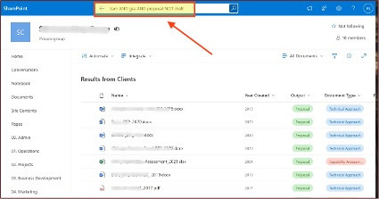
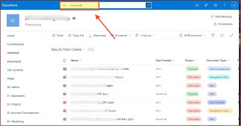
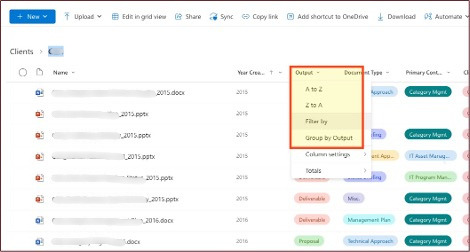

# SharePoint Search Tutorial

## Table of Contents

- [Getting Started](#getting-started)
  - [What You'll Learn](#what-youll-learn)
  - [Who Should Use This Guide](#who-should-use-this-guide)
  - [Prerequisites](#prerequisites)
- [Basic Search Techniques](#basic-search-techniques)
  - [Target Your Search Scope](#target-your-search-scope)
  - [Find Exact Phrases](#find-exact-phrases)
  - [Handle Variations with Wildcards](#handle-variations-with-wildcards)
- [Advanced Search Operators](#advanced-search-operators)
  - [Boolean Logic: AND, OR, NOT](#boolean-logic-and-or-not)
  - [Exclude with Minus Sign (Quick Method)](#exclude-with-minus-sign-quick-method)
- [Alternative Search Approaches](#alternative-search-approaches)
  - [Sort and Filter Instead of Search](#sort-and-filter-instead-of-search)
  - [Expand Your Search Scope](#expand-your-search-scope)
- [Quick Reference Guide](#quick-reference-guide)
  - [Search Operator Cheat Sheet](#search-operator-cheat-sheet)
  - [Common Search Patterns](#common-search-patterns)
- [Troubleshooting Common Issues](#troubleshooting-common-issues)
  - [No Results Found](#no-results-found)
  - [Too Many Results](#too-many-results)
  - [Search Taking Too Long](#search-taking-too-long)
- [Best Practices](#best-practices)
  - [Search Strategy Framework](#search-strategy-framework)
  - [Efficiency Tips](#efficiency-tips)
  - [Building Search Habits](#building-search-habits)
- [Conclusion](#conclusion)

---

## Getting Started

### What You'll Learn

This guide covers the SharePoint search techniques you'll use most often:

- Search by file name or document content
- Find exact phrases
- Combine search terms to narrow results
- Troubleshoot searches that return no results

Start with the Basic Search Techniques section and work forward, or jump to any topic using the table of contents above.

### Who Should Use This Guide

This guide is most useful if you:

- Are new to the team and still learning where things live
- Regularly search for documents across multiple projects or departments
- Find yourself clicking through folders instead of using search
- Keep getting too many results — or none at all

### Prerequisites

- Basic familiarity with SharePoint navigation
- Access to SharePoint sites

---

## Basic Search Techniques

These fundamental techniques form the foundation of effective SharePoint searching. Master these first before moving to advanced operators.

### Target Your Search Scope

**The Challenge:** SharePoint searches everything by default - file names, folder names, document contents, and metadata. This can return overwhelming results.

**The Solution:** Use scope operators to focus your search.

#### Search Document Contents Only

Use `body:keyword` when you know the information is inside a document but not necessarily in the filename.

**Example Scenarios:**
- Finding contracts that mention "termination clause" in the text
- Locating reports containing specific metrics or KPIs
- Searching meeting notes for discussion topics

**Examples:**
```
body:ITAM
body:budget
body:"quarterly review"
```



*Figure 1: Searching Document Contents Only*

#### Search Filenames Only

Use `filename:keyword` when you remember part of the document title but not its contents.

**Example Scenarios:**
- Finding presentations with "Q4" in the title
- Locating templates with specific naming conventions
- Searching for documents by project code

**Examples:**
```
filename:Q4
filename:template
filename:ACME-2024
```

> **Pro Tip:** Combine both approaches for precision: `filename:budget AND body:forecast`

### Find Exact Phrases

**The Problem:** Searching for `cloud migration` returns documents containing either "cloud" OR "migration" anywhere in the content.

**The Solution:** Use double quotes for exact phrase matching.

#### When to Use Exact Phrases

- Technical terms that must appear together
- Company names or product names
- Specific procedures or policy names
- Direct quotes or citations

**Examples:**
```
"cloud migration strategy"
"company policy"
"change management process"
filename:"employee handbook"
```

| Before | After |
|--------|-------|
| `cloud migration` → 847 results | `"cloud migration"` → 23 results |
| (includes any document with either word) | (only documents with the exact phrase) |



*Figure 2: Using quotation marks to find exact phrases*

### Handle Variations with Wildcards

**The Challenge:** You remember part of a name or term but not the exact spelling.

**The Solution:** Use the asterisk (*) wildcard for partial matching.

#### Common Use Cases

- Names with uncertain spelling: `Joh*` finds John, Johnson, Johannes
- Technical terms with variations: `config*` finds configure, configuration, configs
- Product codes or versions: `ACME-202*` finds all 2020-2029 versions

> **Important Limitation:** Wildcards only work at the END of words, not the beginning.
> 
> ✓ Correct: `Joh*`  
> ✗ Incorrect: `*son`



*Figure 3: Searching with a wildcard*

---

## Advanced Search Operators

Once you're comfortable with basic techniques, these operators provide powerful ways to refine and combine searches.

### Boolean Logic: AND, OR, NOT

Boolean operators let you create sophisticated search queries that precisely target what you need.

> **Note**: While keywords themselves are not case-sensitive, it's important to type the operators in CAPITAL letters while searching to ensure proper functionality.

#### AND Operator

**Use when:** You need documents containing ALL specified terms.

**Business Scenarios:**
- Finding budget documents for specific departments: `budget AND marketing`
- Locating project files with multiple requirements: `timeline AND deliverables AND Q4`

**Examples:**
```
ITAM AND policy
body:security AND filename:procedure
"change request" AND approved
```

#### OR Operator

**Use when:** You want documents containing ANY of the specified terms.

**Business Scenarios:**
- Finding documents by multiple possible authors: `author:Smith OR author:Johnson`
- Searching across similar topics: `training OR education OR development`

**Examples:**
```
Q3 OR Q4
filename:report OR filename:summary
contract OR agreement
```

#### NOT Operator

**Use when:** You want to exclude certain terms from results.

**Business Scenarios:**
- Finding current policies, not archived ones: `policy NOT archived`
- Locating active projects, not completed ones: `project NOT completed`

**Examples:**
```
budget NOT draft
"meeting notes" NOT cancelled
filename:template NOT old
```

#### Complex Combinations

You can chain multiple operators for sophisticated searches:

```
(budget OR financial) AND Q4 NOT draft
body:"project status" AND (urgent OR critical) NOT completed
filename:policy AND (HR OR "human resources") NOT archived
```



*Figure 4: Searching with Boolean Operators*

### Exclude with Minus Sign (Quick Method)

**The Shortcut:** Instead of typing NOT, simply use a minus sign (-) before terms you want to exclude.

**When to Use:** For quick exclusions in simple searches.

**Examples:**
```
microsoft -windows
project -completed
report -draft
```

**Comparison:**
- Formal: `microsoft NOT windows`
- Quick: `microsoft -windows`

Both methods work identically, so choose based on your preference.



*Figure 5: Using minus sign to exclude terms*

---

## Alternative Search Approaches

Sometimes traditional searching isn't the most efficient approach. These alternatives can be faster for certain tasks.

### Sort and Filter Instead of Search

**When Sorting/Filtering Works Better:**
- Browsing recent documents
- Looking for specific file types
- Reviewing documents by author or department
- Finding items within a date range

#### Sorting Options

- **Modified Date**: Find recently updated documents
- **Author**: Group documents by creator
- **File Type**: Separate Word docs, PDFs, presentations
- **Size**: Identify large files that might need cleanup

#### Filtering Techniques

- **Metadata Filters**: Use custom properties like Department, Project, or Status
- **Date Ranges**: Filter by creation or modification dates
- **File Type Filters**: Focus on specific document types

**Example Scenario**: Instead of searching for "Q4 budget reports," filter the Finance folder by:
- Date Modified: October-December 2024
- File Type: Excel files
- Sort by: Modified (newest first)



*Figure 6: Using Filter and Sort instead of search*

### Expand Your Search Scope

**When Local Searches Fail:** If you can't find what you're looking for in a specific library or site, expand your search scope.

#### Search Expansion Options

1. **Current Site Search:** Searches only your current SharePoint site
2. **Hub Search:** Searches across related sites in your hub
3. **Global Search:** Searches all SharePoint content you have access to

#### How to Expand:

- Look for "Search all of SharePoint" option at bottom of search results
- Use the search scope dropdown in the search bar
- Access global search from the SharePoint start page

> **Pro Tip:** Start narrow (site-specific) and expand gradually to avoid information overload.


*Figure 7: Example of where to find "Expand search to all items in this site"*

---

## Quick Reference Guide

### Search Operator Cheat Sheet

| Operator | Purpose | Example | Results |
|----------|---------|---------|---------|
| `body:` | Search document contents only | `body:budget` | Docs containing "budget" in text |
| `filename:` | Search filenames only | `filename:Q4` | Files with "Q4" in name |
| `"phrase"` | Exact phrase match | `"change management"` | Exact phrase only |
| `*` | Wildcard (end of word) | `config*` | configure, configuration, etc. |
| `AND` | Both terms required | `budget AND Q4` | Must contain both terms |
| `OR` | Either term acceptable | `report OR summary` | Contains either term |
| `NOT` | Exclude term | `policy NOT draft` | Excludes drafts |
| `-` | Quick exclusion | `project -completed` | Same as NOT |

### Common Search Patterns

#### Finding Recent Work
```
filename:Q4 AND 2024
body:"project status" AND (current OR active)
modified:today
```

#### Locating Templates and Procedures
```
filename:template
body:"step by step" OR body:procedure
"how to" AND (guide OR manual)
```

#### Department-Specific Searches
```
body:HR AND (policy OR procedure)
filename:finance AND (budget OR forecast)
body:IT AND (security OR access)
```

#### Project Documentation
```
body:"project charter" OR body:"project plan"
filename:*-2024 AND deliverable
body:milestone AND (completed OR pending)
```

---

## Troubleshooting Common Issues

### No Results Found

**Possible Causes and Solutions:**

1. **Too Specific Search**
   - Remove some keywords and search broader
   - Use OR instead of AND
   - Try wildcard variations: `config*` instead of `configuration`

2. **Incorrect Spelling**
   - Use wildcards for uncertain spellings
   - Try synonyms or alternative terms
   - Search by author or date if you remember those details

3. **Wrong Search Scope**
   - Expand from site search to global search
   - Check if you're searching the right library
   - Verify you have access to the content location

### Too Many Results

**Refinement Strategies:**

1. **Add More Specific Terms**
   - Include date ranges: `budget AND 2024`
   - Add department or project codes
   - Use exact phrases instead of individual words

2. **Use Exclusion Operators**
   - Remove common but irrelevant terms: `report -template`
   - Exclude old versions: `policy -archived`
   - Filter out specific file types if not needed

3. **Narrow Your Scope**
   - Search specific libraries instead of entire site
   - Use `filename:` if you know it's in the title
   - Filter by date range or author

### Search Taking Too Long

**Performance Optimization:**

1. **Avoid Overly Complex Queries**
   - Break complex searches into multiple simpler ones
   - Use fewer wildcard characters
   - Limit the number of OR operators

2. **Start Specific, Then Broaden**
   - Begin with exact phrases
   - Add wildcards only if needed
   - Use site-specific search before global search

---

## Best Practices

### Search Strategy Framework

1. **Plan Before You Search**
   - **Define what you're looking for:** Document type, time frame, author, topic
   - **Consider where it might be:** Which site, library, or folder
   - **Think about terminology:** What words would the author use?

2. **Start Simple, Get Specific**
   - Begin with 1-2 key terms
   - Add operators only if results are too broad or narrow
   - Use exact phrases for technical terms or proper names

3. **Know Your Content Structure**
   - Understand your team's naming conventions
   - Learn common metadata fields used in your sites
   - Familiarize yourself with folder structures

### Efficiency Tips

#### Save Time with Smart Techniques

- **Use Recent Searches:** SharePoint remembers your recent queries
- **Bookmark Complex Searches:** Save frequently used search URLs
- **Learn Your Team's Patterns:** Understand how colleagues name and organize files

#### Avoid Common Mistakes

- **Don't over-complicate:** Simple searches often work best
- **Check your spelling:** Typos return zero results
- **Remember case sensitivity:** Search terms are not case-sensitive, but operators (AND, OR, NOT) must be capitalized

### Building Search Habits

#### Daily Practices

1. **Use descriptive filenames:** Help others find your documents
2. **Add relevant metadata:** Fill in document properties
3. **Organize logically:** Use consistent folder structures

#### Team Collaboration

1. **Share search tips:** Help colleagues find information faster
2. **Document common searches:** Create a team reference guide
3. **Establish naming conventions:** Make searching predictable across your team

---

## Need Help?

- Contact your SharePoint administrator for technical issues
- Reach out to your site administrators for access questions
- Share additional tips and techniques with your team

---

*This tutorial was created to help teams maximize their SharePoint search efficiency and improve overall productivity.*
